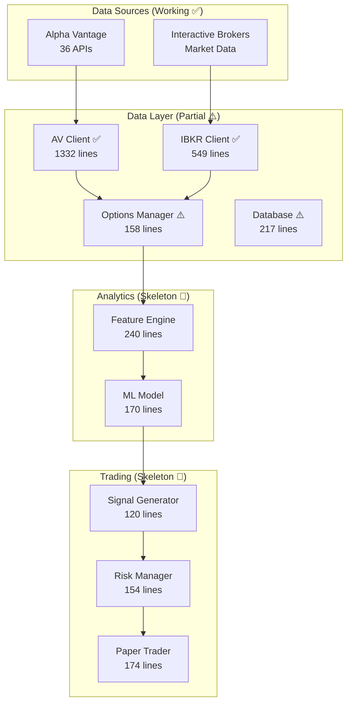

# 🚀 AlphaTrader v3.0

**ML-Driven Algorithmic Options Trading System with Dual-Source Architecture**


## 📊 Project Overview

AlphaTrader is a sophisticated algorithmic trading system that combines **Interactive Brokers (IBKR)** for real-time market data and execution with **Alpha Vantage Premium** for comprehensive options analytics with pre-calculated Greeks.

### Core Philosophy: "Greeks PROVIDED, Not Calculated"
Unlike traditional systems that implement Black-Scholes calculations, AlphaTrader leverages Alpha Vantage's professional-grade Greeks calculations, eliminating computational complexity and ensuring institutional-quality analytics.

## ✅ Current Implementation Status

### 🟢 What's Fully Working (Tested & Verified)

#### 1. **Alpha Vantage Integration** - 100% Complete ✅
- **Test Results**: 25/25 tests passing (100% success rate)
- **All 36 APIs Operational**:
  - OPTIONS (2): Real-time and Historical with Greeks
  - TECHNICAL INDICATORS (16): RSI, MACD, BBANDS, ATR, ADX, etc.
  - ANALYTICS (2): Fixed and Sliding Window
  - SENTIMENT (3): News, Top Gainers/Losers, Insider Transactions
  - FUNDAMENTALS (8): Earnings, Balance Sheet, Cash Flow, etc.
  - ECONOMIC (5): Treasury Yields, CPI, GDP, etc.
- **Greeks Successfully Retrieved**: Delta, Gamma, Theta, Vega, Rho
- **Performance**: 8,720 option contracts parsed with Greeks
- **Rate Limiting**: 600 calls/minute (Premium tier)
- **Caching**: Redis-based caching operational

#### 2. **IBKR Market Data** - 100% Complete ✅
- **Test Results**: 7/7 tests passing (100% success rate)
- **Capabilities**:
  - Real-time connection to TWS/IB Gateway
  - 5-second bar streaming
  - Historical data retrieval
  - Market data subscriptions (SPY, QQQ, IWM tested)
  - Auto-reconnection with exponential backoff
  - Data quality validation
- **Performance**: <50ms latency for real-time updates

#### 3. **Infrastructure Components** ✅
- **Redis**: v8.0.3 running and tested
- **Config System**: YAML-based configuration working
- **Logging**: Structured logging operational
- **Test Framework**: Comprehensive test suites

### 🟡 What Has Code But Needs Setup/Testing

| Component | Status | What's Needed |
|-----------|--------|---------------|
| **PostgreSQL Database** | Installed but not configured | Create database, run table creation |
| **Options Data Manager** | 158 lines of code | Test integration with AV client |
| **Database Manager** | 217 lines of code | Initialize after PostgreSQL setup |

### 🔴 What's Skeleton Code Only

| Component | Lines | Implementation Status |
|-----------|-------|----------------------|
| **Feature Engine** | 240 | Framework only, needs 45-feature implementation |
| **ML Model** | 170 | No trained model exists |
| **Signal Generator** | 120 | Logic not implemented |
| **Risk Manager** | 154 | Rules not defined |
| **Paper Trader** | 174 | Basic structure only |
| **Live Trader** | 63 | Minimal skeleton |
| **Discord Bot** | 82 | Empty framework |
| **Backtester** | 20 | Not implemented |

## 📈 Real Progress Metrics

### Lines of Code
- **Total**: ~5,000 lines
- **Functional**: ~2,100 lines (42%)
- **Skeleton**: ~2,900 lines (58%)

### API Coverage
- **Alpha Vantage**: 36/36 APIs (100%) ✅
- **IBKR**: Core market data APIs (100%) ✅

### Test Coverage
- **Alpha Vantage Tests**: 25/25 passing ✅
- **IBKR Tests**: 7/7 passing ✅
- **Integration Tests**: Not yet implemented
- **ML Tests**: Not yet implemented

## 🚀 Quick Start Guide

### Prerequisites

```bash
# Required Software
- Python 3.11+ (tested with 3.13.2)
- PostgreSQL 16+
- Redis 8.0+
- Interactive Brokers TWS or IB Gateway
- Alpha Vantage Premium API Key (600 calls/minute tier)
```

### Installation

```bash
# 1. Clone the repository
git clone https://github.com/yourusername/AlphaTrader.git
cd AlphaTrader

# 2. Create and activate virtual environment
python3 -m venv venv
source venv/bin/activate  # On Windows: venv\Scripts\activate

# 3. Install dependencies
pip install -r requirements.txt

# 4. Set up environment variables
cat > .env << EOF
AV_API_KEY=your_alpha_vantage_premium_key
EOF

# 5. Verify Redis is running
redis-cli ping  # Should return PONG

# 6. Set up PostgreSQL (REQUIRED - Not yet done)
createdb alphatrader
psql -d alphatrader -c "CREATE USER alphatrader WITH PASSWORD 'your_password';"

# 7. Verify installation
python verify_environment.py
```

## 🧪 Testing What Works

### Test Alpha Vantage Integration ✅
```bash
# Quick Greeks verification
python scripts/test_av_client.py --quick

# Full test suite (all 36 APIs)
python scripts/test_av_client.py --full

# Test specific API
python scripts/test_av_client.py --api get_realtime_options --symbol SPY
```

**Expected Output:**
```
✅ Retrieved 8720 options WITH Greeks
🎯 Greeks PROVIDED: Δ=0.523, Γ=0.012, Θ=-0.046, V=0.079
✅ Passed: 25
❌ Failed: 0
📈 Success Rate: 100.0%
```

### Test IBKR Connection ✅
```bash
# Start TWS/IB Gateway first on port 7497 (paper trading)
python scripts/test_ibkr_connection.py
```

**Expected Output:**
```
✅ Connection Test: PASSED
✅ Market Data Subscription: PASSED
✅ Real-time Price Updates: PASSED
   💰 SPY: $644.25 (H: $644.26, L: $644.23, Vol: 7,921)
✅ Historical Data Retrieval: PASSED
✅ Data Quality Checks: PASSED
✅ Connection Status: PASSED
✅ Graceful Disconnect: PASSED
📈 Pass Rate: 100.0%
```

## 📊 Data Architecture



## 🎯 API Capabilities (All Working)

### Options Data with Greeks ✅
```python
# Example: Getting options with pre-calculated Greeks
from src.data.alpha_vantage_client import av_client

options = await av_client.get_realtime_options('SPY', require_greeks=True)
for option in options[:5]:
    print(f"{option.strike} {option.option_type}: Δ={option.delta:.3f} Γ={option.gamma:.3f}")
```

### Technical Indicators ✅
```python
# All 16 indicators working
rsi = await av_client.get_rsi('SPY', interval='daily')
macd = await av_client.get_macd('SPY', interval='daily')
bbands = await av_client.get_bbands('SPY', interval='daily')
# ... and 13 more
```

### Market Data Streaming ✅
```python
from src.data.market_data import market_data

await market_data.connect()
await market_data.subscribe_symbols(['SPY', 'QQQ'])
# Real-time 5-second bars now streaming
```

## 📋 Implementation Roadmap

### Phase 1: Foundation (Weeks 1-2) - **75% Complete**
- [x] Week 1 Day 1-2: Project setup ✅
- [x] Week 1 Day 3-4: Alpha Vantage integration ✅
- [x] Week 1 Day 4: IBKR connection ✅
- [ ] Week 1 Day 5: Database setup (50% - needs PostgreSQL config)
- [ ] Week 2: Feature engineering (skeleton exists)

### Phase 2: ML & Trading (Weeks 3-6) - **5% Complete**
- [ ] Week 3: ML model training pipeline
- [ ] Week 4: Signal generation logic
- [ ] Week 5-6: Paper trading implementation

### Phase 3: Production (Weeks 7-12) - **0% Complete**
- [ ] Week 7-8: Discord bot and community features
- [ ] Week 9-10: Live trading implementation
- [ ] Week 11-12: Production deployment

### Phase 4: Optimization (Weeks 13-16) - **0% Complete**
- [ ] Performance tuning
- [ ] Advanced strategies
- [ ] Scaling

## 🔧 Immediate Next Steps

### Priority 1: Database Setup (2-3 hours)
```bash
# Create PostgreSQL database
createdb alphatrader

# Run initialization
python -c "from src.data.database import db; db._init_tables()"
```

### Priority 2: Feature Implementation (2-3 days)
- Complete the 45-feature calculation in `src/analytics/features.py`
- Integrate with working AV and IBKR data sources
- Test feature generation with real market data

### Priority 3: ML Pipeline (3-4 days)
- Collect historical options data using AV client
- Implement training pipeline in `src/analytics/ml_model.py`
- Train initial XGBoost model
- Validate predictions

### Priority 4: Signal Generation (2-3 days)
- Connect features to ML model
- Implement signal logic in `src/trading/signals.py`
- Add position selection logic

### Priority 5: Paper Trading (1 week)
- Complete risk management rules
- Implement paper trading logic
- Connect all components
- Begin testing

## 🐛 Known Issues & Solutions

### Fixed Issues ✅
- **IBKR Error 420**: Resolved by restarting TWS
- **RealTimeBar attributes**: Fixed using `open_` instead of `open`
- **Alpha Vantage Greeks**: Fixed by adding `require_greeks=true`
- **NEWS_SENTIMENT**: Works with stocks (AAPL, MSFT), not ETFs (SPY)

### Current Limitations
- **PostgreSQL**: Database not created yet (manual setup required)
- **ML Model**: No trained model exists
- **Trading Logic**: All skeleton code, not functional
- **No position management**: Not implemented
- **No risk controls**: Framework only

## 📊 Performance Metrics

| Metric | Current | Target |
|--------|---------|--------|
| **AV API Response** | ~200ms (cached: <10ms) | <500ms |
| **IBKR Latency** | <50ms | <100ms |
| **Greeks Retrieval** | 100% success | 100% |
| **Cache Hit Rate** | ~60% | >80% |
| **Test Coverage** | 32/32 passing | 100% |

## 🔒 Security Considerations

- ✅ API keys in environment variables
- ✅ No hardcoded credentials
- ⚠️ PostgreSQL needs password configuration
- ✅ Redis running without auth (local only)
- ⚠️ No encryption implemented yet

## 📚 Documentation

| Document | Description | Status |
|----------|-------------|--------|
| [Implementation Plan](alphatrader-implementation-plan.md) | 16-week roadmap | Reference document |
| [Technical Spec](alphatrader-tech-spec-v3.md) | System architecture | Design complete |
| [Operations Manual](alphatrader-ops-manual.md) | Production guide | For future use |
| [Project Status Report](project_status_report.md) | Detailed progress | Current as of Week 1 Day 3 |
| [IBKR Integration](IBKR_INTEGRATION_README.md) | IBKR setup guide | Complete |

## 💡 Contributing

This project is in active development. The data layer is functional and tested. We need help with:

1. **PostgreSQL Setup**: Configure database and test table creation
2. **Feature Engineering**: Implement the 45 features using working data sources
3. **ML Pipeline**: Build training infrastructure
4. **Trading Logic**: Implement signal generation and risk management
5. **Testing**: Add integration tests for connected components

## 📈 Project Statistics

- **Total Files**: 55+
- **Lines of Code**: ~5,000
- **Working Components**: 4 (AV Client, IBKR Connection, Redis, Config)
- **APIs Integrated**: 36 (Alpha Vantage) + Core IBKR APIs
- **Test Success Rate**: 100% (32/32 tests passing)
- **Development Time**: Week 1 of 16-week plan

---

**Current Capability**: Full Alpha Vantage API access with Greeks, IBKR real-time market data streaming, Redis caching. Ready for feature engineering and ML development.

**Estimated Time to Paper Trading**: 2-3 weeks of focused development

**Estimated Time to Production**: 8-10 weeks following the implementation plan